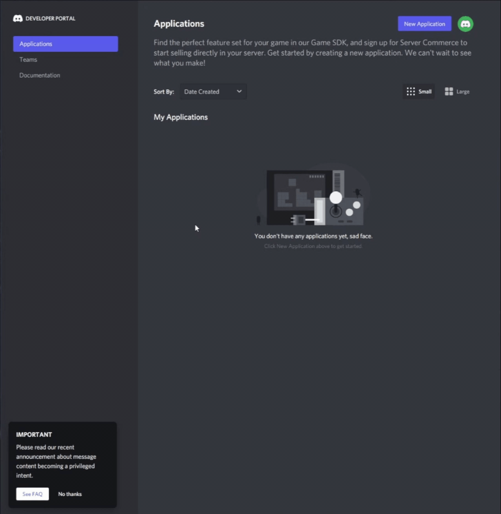
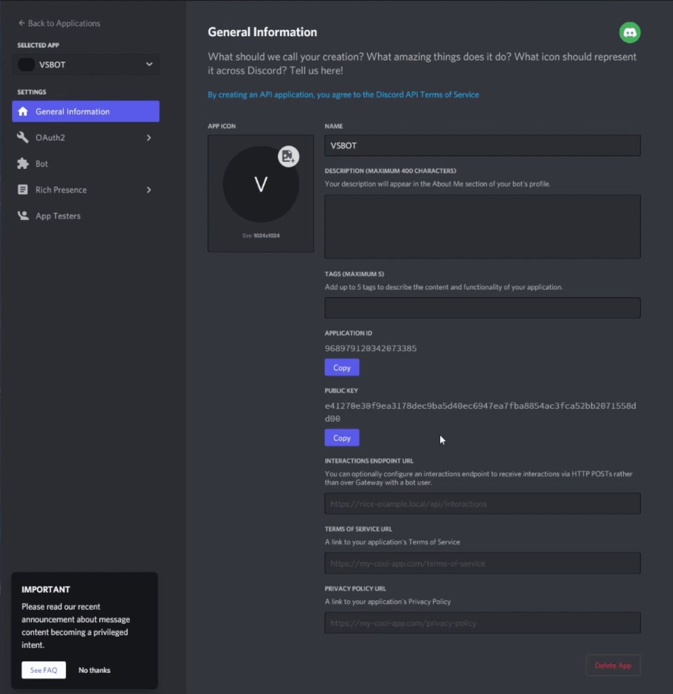
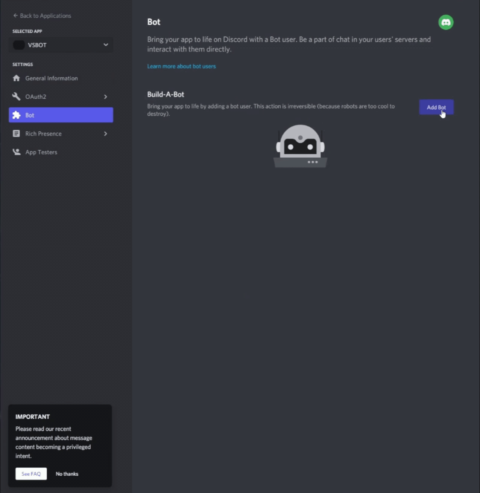
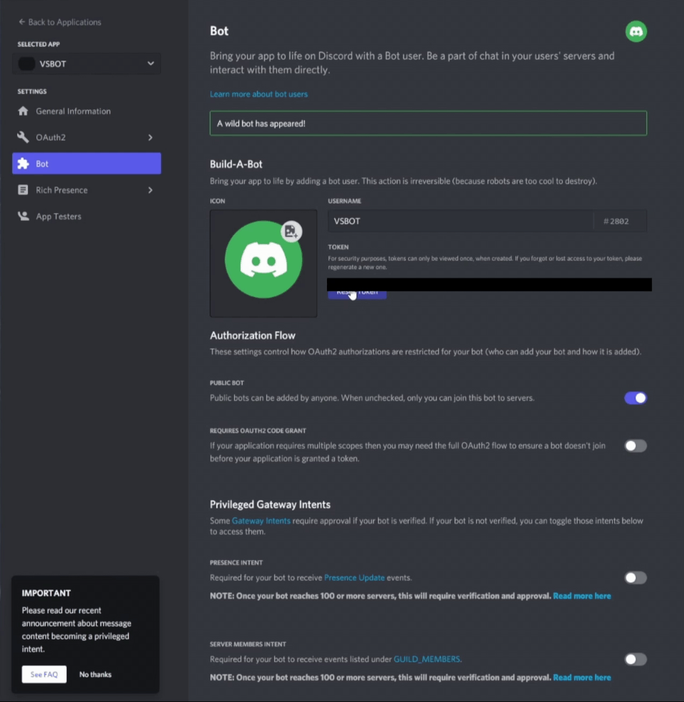

# Discord Parrot

A VSCode extension that allows you to use your own Discord Bot to send and receive messages in VSCode from Discord.

## Technologies Used

* HTML
* CSS
* Bootstrap
* JavaScript
* jQuery
* npm
* webpack
* ESLint
* Discord API
* discord.io
* JSON

## Setup/Installation Requirements

### Getting the Repository

* Clone this repository to your desktop or any directory of your choice
  * Run the command below in a bash terminal with [git](https://github.com/git-guides/install-git) installed
```
git clone https://github.com/WillRod42/vs-discord.git
```
* Or download as a zip file
  * Click the green code button on the repository page
  * At the bottom of the popup window select `Download ZIP`
  * Extract the downloaded .zip folder

### Installing Dependencies

* Make sure you have [node](https://nodejs.org/en/download/) installed
* Open bash terminal in the top level of this directory
* run `npm install` to install dependencies

### Creating a Discord Bot

* This project does not include a discord bot, you must create your own in order to use this extension
  * Remember to read and follow [Discord's Developer Terms of Service](https://discord.com/developers/docs/policies-and-agreements/terms-of-service)
  * Create a Discord bot and use this project _**at your own risk**_
* Log in to your discord account and go [Discord's Developer Portal](https://discordapp.com/developers/applications/me)
  * If you do not already have a discord account, create one [here](https://discord.com/)
* In the `Applications` tab, click the `New Application` button in the top right<br><br>

<br><br>

* On the left, select the `Bot` tab, and inside click the `Add Bot` button<br><br>



* Give the bot a name in the username textbox
* Click the `Reset Token` button and copy the key
  * __Do not__ share this with anyone, this key grants control over your bot<br><br>

<br><br>

* Go back to the project directory and create a file named `.env`
  * Inside add this line and save the file
  ```
  API_KEY=<Your key here without brackets>
  ```

### Adding the Bot to Your Server

* You will need to add your bot to the server you want to message on
  * You will need a user on the server with the appropriate permissions to add the bot for you
* Log in to your discord account and go [Discord's Developer Portal](https://discordapp.com/developers/applications/me)
* Select your application, click the `OAuth2` tab, and click `URL Generator` underneath that 
* Under `scopes`, select the `bot` checkbox and under `bot permissions` select the `Administrator` checkbox<br><br>

<br><br>

* Have your authorized user open the generated link at the bottom to add your bot to the server

### Setting up and Using the Extension
*  Move/copy the repository folder (/vs-discord) into the VSCode extensions directory 
  ```````````````````````````
  (C:/Users/Username/.vscode/extensions)
  ```````````````````````````
* Launch a VSCode session and open the command pallet (_ctrl + shif + p_ for Windows/Linux and _cmd + shift + p_ for Mac)
* Type "Parrot Start" in the command pallet and hit enter and the extension should open in a new tab in VSCode
  * Servers that you bot has been added to will show up on the left. Click on the server you wish to view and then click on the channel you wish to view/send messages to.
  *  To set you username click on the "Set Name" button which will show an input field to input your username and hit enter to set it.
  * To send a message just type in the chat input field at the bottom of the extension and hit enter.
  * If you send a message without setting a username your username will by "Anonymous".

## Known Issues

* None

## License

[MIT](https://opensource.org/licenses/MIT)

Copyright (c) 2022 Caleb Coughenour, Cameron Ray, Jeremy Martin, & William Rodriguez